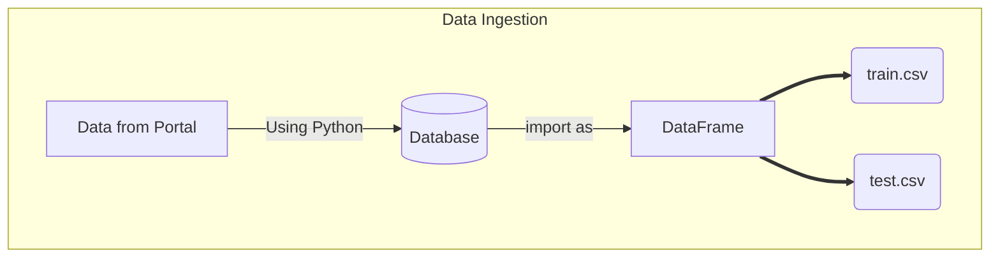
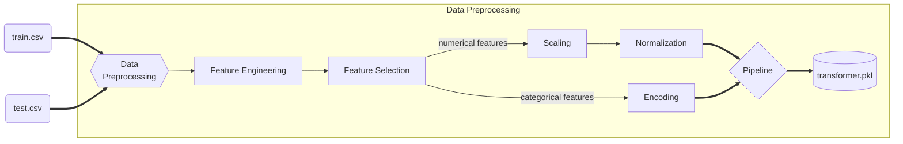
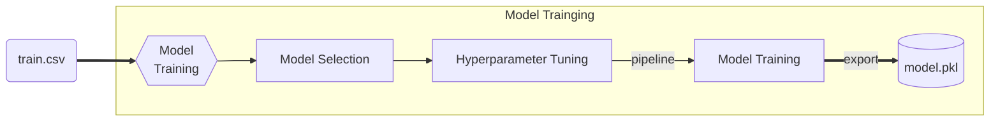
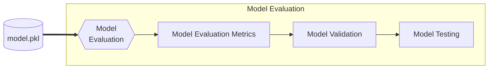
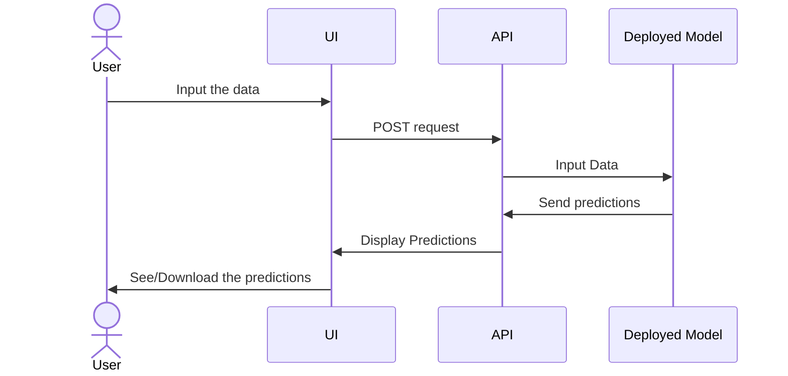
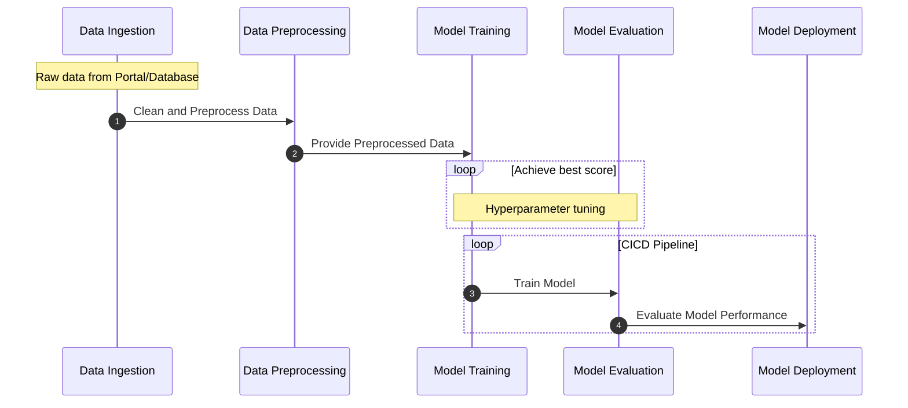

# Low-Level Design (LLD) Document

# {[ProjectName]}

Table of Contents

{[TableOfContent]}

### 1. Problem Statement

{[ProblemStatement]}

### 2. System Architecture

The system architecture will consist of the following major components:

- Data Ingestion Module
- Data Validation Module
- Data Transformation Module
- Model Training Module
- Model Evaluation Module
- Model Deployment Module

### 3. Data Ingestion Module

Project data is already provided by the Ineuron Portal. But we upload that data into database using python and then write a function to collect/import all the data from database then convert it into DataFrame for further processes.

- Split the preprocessed data into training and testing sets and export it to perform further processes on each files separately.

### 4. Data Validation Module

The Data Validation Module will perform the following tasks:

- Validate the integrity and quality of the ingested data.
- Handle missing or erroneous values.
- Ensure data consistency and adherence to predefined standards.

### 5. Data Transformation Module

The Data Transformation Module will carry out the following operations:

- Feature engineering to create new relevant features from the existing data.
- Data normalization to bring numerical features within a similar scale.
- Encoding categorical variables to prepare them for model training.
- Balance the unbalanced features using SMOTE technique.

### 6. Model Training Module

The Model Training Module will:

- Apply various machine learning algorithms like Random Forest, Gradient Boosting, SVM, etc. to achieve the best score.
- Perform hyperparameter tuning using `GridSearchCV`.

### 7. Model Evaluation Module

The Model Evaluation Module will assess the model's performance using appropriate metrics such as:

{[ModelEvaluationPoints]}

### 8. Model Deployment Module

The Model Deployment Module will:

- Deploy the trained machine learning model into a production environment.
- Provide an API endpoint for making real-time predictions on new data.

### 9. User Interface

The project will have a user interface where users can input product information, and the model will provide backorder predictions.

### 10. Model Monitoring and Maintenance

The deployed model will be continuously monitored for performance and accuracy. If the model's performance degrades over time, retraining and updating the model will be performed to maintain its effectiveness.

### 14. Documentation and Collaboration

The entire project, including code, data, and model documentation, will be uploaded on [Github]({[GithubRepoLink]}). Anyone can collaborate on this project by enhancing the project codes and model.

### 17. Conclusion

The LLD document lays the foundation for the project. It outlines the system architecture, components, and their interactions. The document serves as a guide for the development, implementation, and maintenance of the project, ensuring a structured and organized approach.

